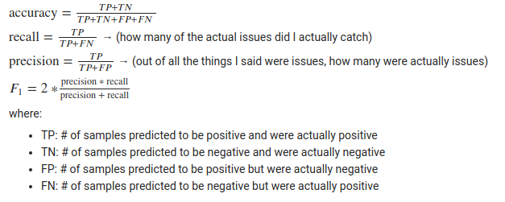

### Notes
- 安装pytorch0.3.0和cuda8：conda install pytorch=0.3.0 torchvision cuda80 -c pytorch
- 将安装好的cuda8与导入的pytorch成功运行：export LD_LIBRARY_PATH=/home/jiangkun/anaconda3/pkgs/cudatoolkit-8.0-1/lib（可以先用find / -name libcudart.so.8.0找到路径）
- 在windows利用anaconda安装tensorflow时，只能建立在python3.x的版本上，因此python2版本在windows上无法安装tensorflow
- [配置谷歌云计算平台GCE](https://zhuanlan.zhihu.com/p/33099231)，[本地ubuntu连接GCE](https://www.jianshu.com/p/57e85cf3e50b)
- [Stanford CoreNLP在ubuntu下的安装与使用](https://blog.csdn.net/Hay54/article/details/82313535)，安装好java环境之后，将相关jar文件添加入CLASSPATH即可`export CLASSPATH=/home/username/DrQA/data/corenlp/*`
- 在ParagraphRanker里activate ranker环境后，运行“single.mdl”来做预测，会弹出`ModuleNotFoundError: No module named 'drqa'`。即使利用DrQA里安装`drqa==0.1.0`的方法，依然报错。解决方法为：`cp -r ~/DrQA/drqa ~/ParagraphRanker`
- **np.sum(a, axis=0, keepdims=True)**：axis=0是指X轴，即矩阵a的每一列的和，而axis=1则指Y轴，即矩阵a每一行的和。keepdims=True表示做完和以后，结果依然保持原来的矩阵格式，不会变成np.array这样形式的数组
- **np.random.rand vs np.random.randn**：前者数值服从均匀分布，后者数值服从正态分布
- **显卡**：（GPU）主流是Nvidia的GPU，深度学习本身需要大量计算。GPU的并行计算能力，在过去几年里恰当地满足了深度学习的需求。AMD的GPU基本没有什么支持，可以不用考虑。
- **驱动**：没有显卡驱动，就不能识别GPU硬件，不能调用其计算资源。
- **CUDA**：是Nvidia推出的只能用于自家GPU的并行计算框架。只有安装这个框架才能够进行复杂的并行计算。安装CUDA的同时也安装了能识别GPU硬件，调用其计算资源的driver。主流的深度学习框架也都是基于CUDA进行GPU并行加速的，几乎无一例外。还有一个叫做cudnn，是针对深度卷积神经网络的加速库。
- `urllib.error.URLError: <urlopen error [Errno -3] Temporary failure in name r`：解决办法，在程序开始加上：`from urllib.request import urlopen`
- FileZilla上传文件至GCE：[Google Cloud FTP Setup with FileZilla ](https://www.onepagezen.com/google-cloud-ftp-filezilla-quick-start/)。Windows下该key文件在E盘的putty文件夹里的key1，用户名为rsa-key-20190114。
- Hash：一般翻译做“散列”，也有直接音译为“哈希”的，就是把任意长度的输入（又叫做预映射， pre-image），通过散列算法，变换成固定长度的输出，该输出就是散列值。这种转换是一种压缩映射，也就是，散列值的空间通常远小于输入的空间，不同的输入可能会散列成相同的输出，而不可能从散列值来唯一的确定输入值。简单的说就是一种将任意长度的消息压缩到某一固定长度的消息摘要的函数。
- [T检验](https://blog.csdn.net/shulixu/article/details/53354206);[T检验](https://blog.csdn.net/u011331731/article/details/72858416)
 - **true positive, true negative, false positive, false negative**
 
 - **import argparse**
 ```
 import argparse

parser = argparse.ArgumentParser()
parser.add_argument("--square-file", help="display a square of a given number", type=int)
parser.add_argument("--cubic-file", help="display a cubic of a given number", type=int)
args = parser.parse_args()
if args.square_file:
        print(args.square_file**2)
if args.cubic_file:
        print(args.cubic_file**3)


>>>
(HotpotQA) jiangkun@xixi:~/test$ python args.py -h
usage: args.py [-h] [--square-file SQUARE_FILE] [--cubic-file CUBIC_FILE]

optional arguments:
  -h, --help            show this help message and exit
  --square-file SQUARE_FILE
                        display a square of a given number
  --cubic-file CUBIC_FILE
                        display a cubic of a given number

 ```

### HotpotQA
- **测试集**：对于该数据集的Test set in the fullwiki setting，该测试集只包含了question和basic IR model检索出来的对应每个问题的paragraphs，并没有答案和相对应的supporting facts，因此只需要用改进后的IR model检索出来的paragraphs来代替之前的paragraphs后，对测试集里的问题的答案和supporting facts进行预测，将结果上传到作者提供的evaluation server即可。
- **JSON Format**：[{_id:, question:, answer:, supporting_facts:, context:}, {_id:, question:, answer:, supporting_facts:, context:}, {_id:, question:, answer:, supporting_facts:, context:} .......]
- **Supporting Facts**：[[title, sent_id], [title, sent_id], [title, sent_id] ........]
- **Context**：[[title, sentences], [title, sentences], [title, sentences] ......]，其中，sentences = [string1, string2, string3, ......]
- The QA pairs from dev set in distractor and fullwiki setting are the same. The only difference between them is the context. Distractor setting has gold paragraphs in 10 paragraphs, while fullwiki setting may or may not have them, because the paragraphs come from the basic IR system.
- Dev set in distractor setting and fullwiki setting both have supporting facts, so we could know which document is related to the question. So the dataset from HotpotQA can be used for training neural IR model.
- **??? why training set also has irrelated context which are used for training Reading Comprehension model?**
- HotpotQA dataset can have another metric for IR model which is [Success@k](https://arxiv.org/pdf/1808.10628.pdf).

- **利用DrQA里的TF-IDF model对来自HotpotQA和SQuAD进行检索测试**:
数据格式脚本见[这里](./scripts/DrQA_eval_txt.py)
```
python scripts/retriever/eval.py ~/DrQA/data/datasets/hotpotreduced-dev.txt # HotpotQA
python scripts/retriever/eval.py ~/DrQA/data/datasets/stanford-dev.txt # SQuAD
```
### DrQA
- **SQuAD-v1.1-train.json**：对于SQuAD的json文件，它只有一行，是一个dict，包含了很多数据点
```
with open('./SQuAD-v1.1-train.json') as f:
    dataset = json.load(f)

for line in open('./SQuAD-v1.1-train.json'):
    dataset = json.loads(line) # SQuAD.json只有一行，所以用这个方法生成的数据也只有一行
```

### Research Questions
1. Find out what type of questions the current ranker gets wrong - can you categorize them ? Maybe there are categories of errors that are prominent
2. Use your IR knowledge and the literature to argue theoretically how to address those bigger error categories
3. Implement the IR model(s) (deep or not) that your determined to be the right one(s) to use in (2)
4. Analyze whether the used model reduces some of those errors - it should if steps (1)-(3) have been done correctly
5. Propose an adaptation to the model of (3) to also improve its performance in at least in error category that the current model is not good at

### Feedback
- **Research Proposal**: 
    - one step at a time. You can already write your proposal up as part of the introduction - section 2.2 certainly belongs into the introduction, as an easy motivation for your work.
- **Types of Questions and Errors**:  
    - so, this initial analysis is already looking good you can definitely use it as motivation for your thesis work
    - For Section 3 you should have a more principled writeup e.g. you sample 100 non-top-5 queries and determine the PERCENTAGE of each error category right now, it is still not clear what the prevalent issue is. you found some issues, but does each of those occur once in 100 example or in 90 out of the 100 failures? this is an important difference
    - for completeness, the TF.IDF model should also be explained - right now it is not on a level that allows someone to reproduce the results
    - and overall, i would like to see a short discussion of what the top-5 performance means - for an IR task, this is actually pretty good i would say (though it depends of course how many items have to be ranked per question)
    - but you are on the right track and all of this content is usable for the thesis

### Datasets
| Dataset  | Description                                                                                                                                                                                                                    |
|----------|--------------------------------------------------------------------------------------------------------------------------------------------------------------------------------------------------------------------------------|
| SearchQA | uses a commercial search engine, and does not provide negative contexts not containing the answer, making research into the retrieval component difficult                                                                      |
| QUASAR-T | Using ClueWeb09, which contains about 1 billion web pages collected between January and February 2009                                                                                                                          |
| WIKIQA   | introduced as a largerscale dataset for the subtask of answer sentence selection, however it does not identify spans of the actual answer within the selected sentence.                                                        |
| MOVIESQA | answer questions about movies from a background corpus of Wikipedia articles. many of these are similarly phrased and fall into one of only 13 different categories; hence, existing systems already have ∼ 85% accuracy on it |
| MS MARCO | consists of diverse real-world queries collected from Bing search logs, however many of them not factual (bad quality), which makes their evaluation tricky                                                                                  |
| TriviaQA | obtained using a commercial search engine, making it difficult for researchers to vary the retrieval step of the QA system in a controlled fashion                                                                             |